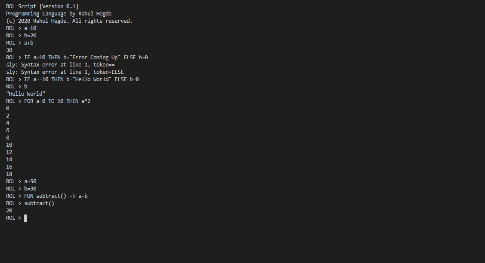

# ROL-Script
Visit [here](https://www.geeksforgeeks.org/how-to-create-a-programming-language-using-python/) to view my detailed published article on this subject.

ROL Script is a programming language created by me using sly.
Everything in ROL is a single line interpretation(like Python or JavaScript).

## Installation
- Install Python3
- Install sly using
  ```pip install sly```
- Clone the repository
- Open terminal and execute
  ```python rol.py```

## Syntax
### Assignment
```
var_name = value
var_name = "string"
```

### Arithmetic Operations(Only Integers)
```
var_1 = value1
var_2 = value2
add = var_1 + var_2
subtract = var_1 - var_2
multiply = var_1 * var_2
divide = var_2 
```

### Conditionals
```
IF condition_1 THEN statement_1 ELSE statement_2
```

### Loops
```
FOR var_1 = start_value TO var_1 = end_value THEN var_1
```

### Functions
```
FUN function_name() -> function_statements_to_ executed

function_name
```

### Comments
```
//This is a comment
```

## Example

